# Aspire Showcase

React + ASP.NET Core API with [Aspire](https://aspire.dev), deployed to Azure Container Apps.

## This project is juset a showcase what can be done with Aspire. It's not a production-ready app.

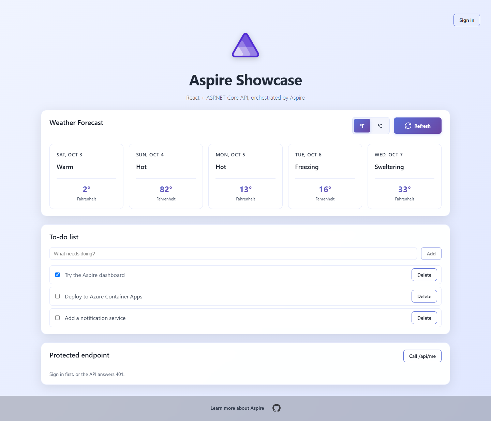

## What this shows

One AppHost describes the whole system: a React app, an ASP.NET Core API, a notifications service the API calls, [Logto](https://logto.io) for sign-in, one PostgreSQL server holding the app's database and Logto's, and Redis as a cache. The same description is used twice:

- **Locally**, `aspire run` starts everything on your machine (the API and the notifications service as processes, Vite with hot reload, Logto, PostgreSQL and Redis as containers) and sends logs, traces and metrics to the Aspire dashboard.
- **In Azure**, `aspire deploy` turns it into Container Apps, a PostgreSQL Flexible Server, Key Vault and Application Insights, from a GitHub Actions workflow.

The app itself is small on purpose (a weather forecast, a to-do list with notifications and one protected endpoint); the point is the AppHost in `src/AspireShowcase.AppHost`.

## Run locally

Needs .NET 10, Node.js 22 and Docker (for PostgreSQL, Redis and Logto).

```
dotnet run --project src/AspireShowcase.AppHost
```

Open the `Dashboard:` link (e.g. `https://localhost:17019/login?t=...`), then `frontend`.

The to-do list needs sign-in: the first time, [set up Logto](#set-up-sign-in).

## Aspire dashboard

Resources, with their state, endpoints and the custom `Admin console` and `Swagger` links:

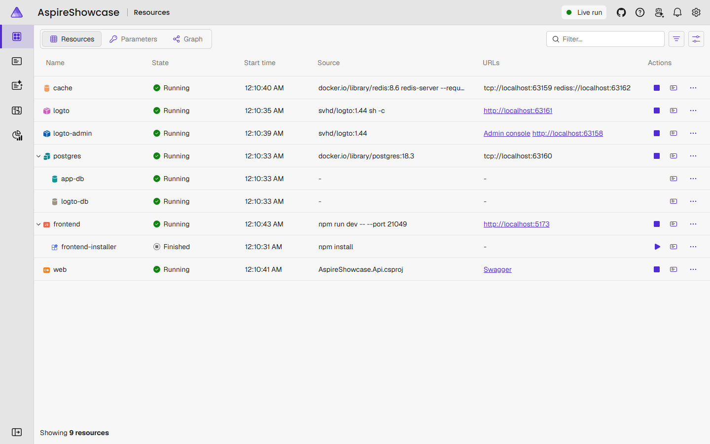

The same resources as a graph of references and wait dependencies:

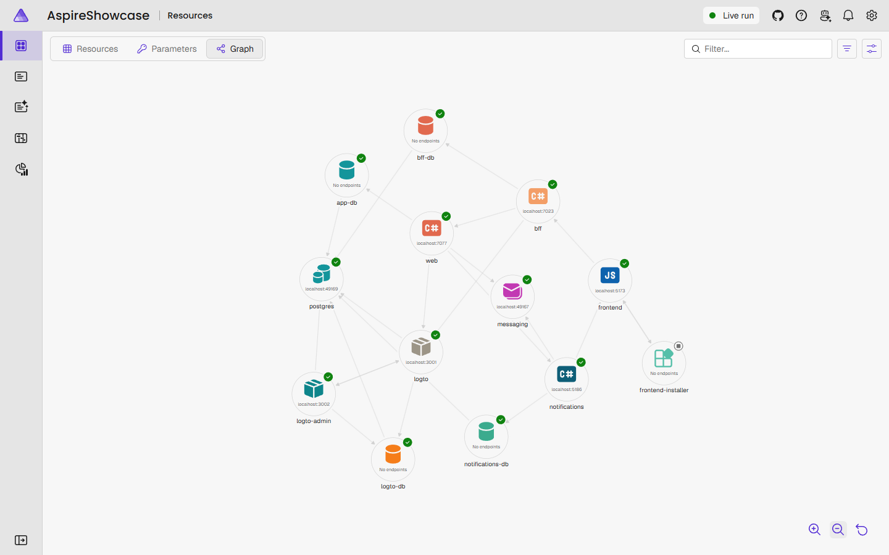

Traces of the API requests made by the React app, with the database queries as `app-db` spans and the Redis commands as `cache` spans. A `GET /api/todos/` without an `app-db` span was answered from the cache:

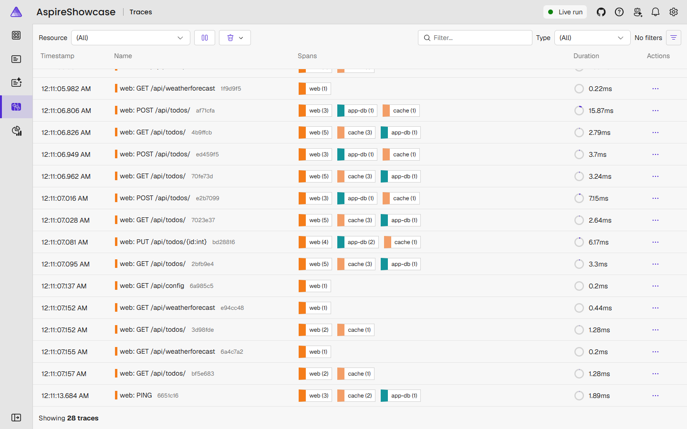

One request in detail: the API's own `todos.update` span around the two database queries and the Redis command. The span's events (outlined in red) show as dots on its bar and are listed under Events in the span details: `todo.updated`, `todo.completed` with the time it took, and `cache.invalidated`.

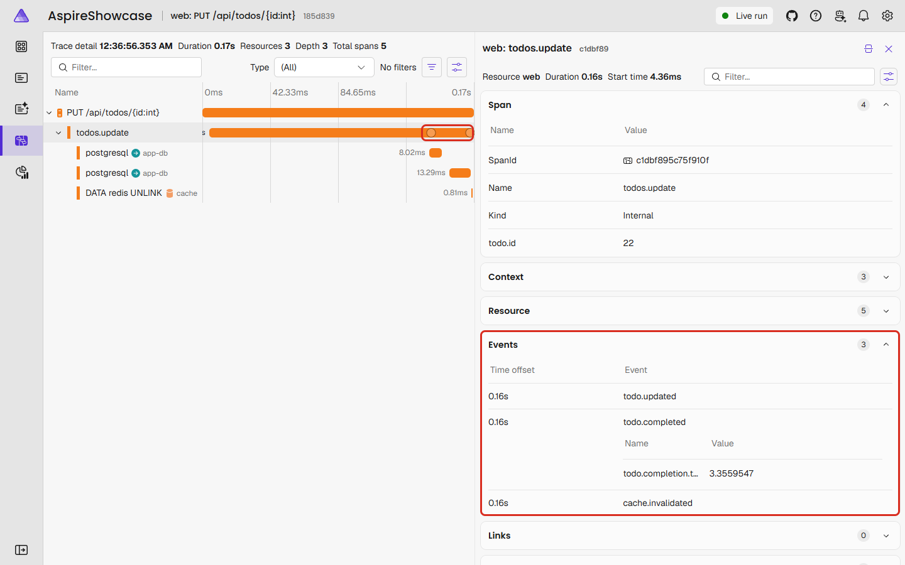

A trace across two services: adding a to-do item in `web` calls `notifications`, and both sides show in one trace.

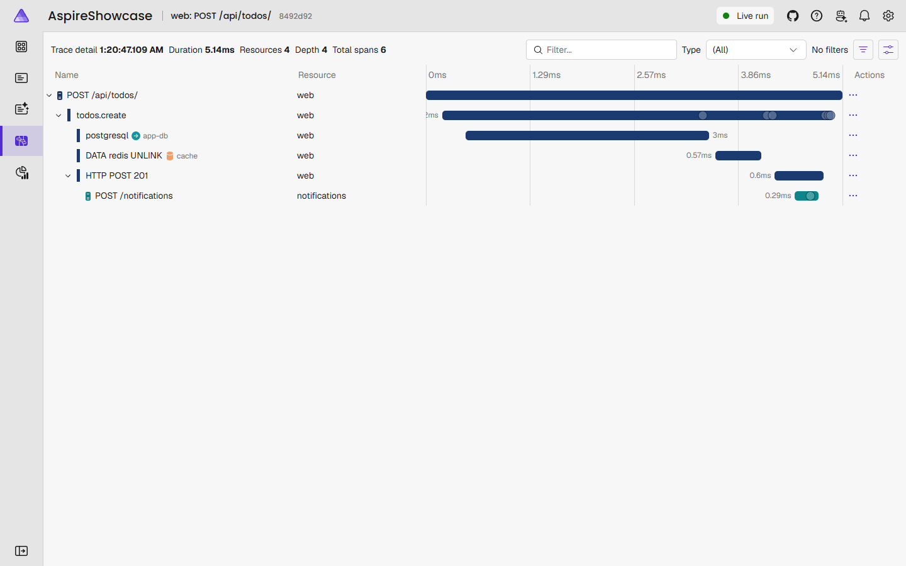

The API's own metrics, next to the ones from ASP.NET Core and Npgsql:

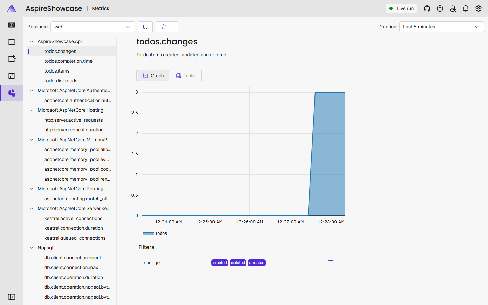

## Layout

```
src/
├── AspireShowcase.AppHost/          # orchestration + Azure target
├── AspireShowcase.ServiceDefaults/  # telemetry, health checks
├── AspireShowcase.Api/              # API, serves the UI in Azure
├── AspireShowcase.Notifications/    # notifications service, called by the API
└── AspireShowcase.Web/              # React + Vite
```

## Database

One PostgreSQL server, the `postgres` resource, holds two databases:

| Resource | Database | Used by |
|---|---|---|
| `app-db` | `app` | The API: the to-do list behind `/api/todos` (EF Core) |
| `logto-db` | `logto` | Logto |

- Local: a PostgreSQL container with its data in a Docker volume, so the data survives restarts. The password is generated on first run and saved in the AppHost's user secrets.
- Azure: an Azure Database for PostgreSQL Flexible Server (Burstable B1ms, password auth, TLS). The admin password comes from the `POSTGRES_PASSWORD` secret on the `production` environment, which `setup-azure-oidc.ps1` generates.
  The connection strings are stored in Key Vault (`kv`). The Container Apps read them from there with their managed identities (Key Vault Secrets User), so the password is not in their configuration.

The API creates and updates its tables on startup from the EF Core migrations in `src/AspireShowcase.Api/Migrations`. After changing the model, add a migration:

```
dotnet tool restore
dotnet ef migrations add <Name> --project src/AspireShowcase.Api
```

## Cache

The API keeps the to-do list in Redis, the `cache` resource, for up to 5 minutes. Adding, changing or deleting an item removes the cached list, so the next request reads the database again.

Redis runs as a container both locally and in Azure. In Azure it's a Container App reachable only from inside the Container Apps environment, protected by a password. It keeps nothing on disk: a restart empties the cache and the API fills it again.

## Notifications

`AspireShowcase.Notifications` is a second ASP.NET Core service, the `notifications` resource. After a to-do item is added or removed, the API posts a notification to it; the service keeps the latest 50 in memory, and the Notifications card in the app lists the newest five.

- The API calls it as `http://notifications`. The AppHost's `WithReference` passes the real address, and service discovery from ServiceDefaults resolves the name, both locally and in Azure.
- The browser never talks to it. The card reads `/api/notifications`, which the API passes on. In Azure the service is a Container App with no external endpoint.
- Notifications are an extra: a call gets 3 seconds, and after a failure the service is left alone for 15 seconds, so the to-do list keeps working when it's down.
- They live in memory, so a restart of the service empties the list.

## Logto

[Logto](https://logto.io) handles authentication. It runs as two containers from the same image, sharing one database:

| Resource | Port | Serves |
|---|---|---|
| `logto` | 3001 | Sign-in and OIDC endpoints (`ENDPOINT`). Seeds the database on first start. |
| `logto-admin` | 3002 | Admin console at `/console` (`ADMIN_ENDPOINT`) |

Two containers, because a Container App has only one HTTP ingress port.

Its database is `logto-db` (see [Database](#database)). Logto wants a `postgresql://` URL rather than a .NET connection string, so in Azure the URL is stored in Key Vault as its own secret, `logto-db-url`.

Locally the console is served on `http://127.0.0.1:<port>/console`, not `localhost`: Logto runs in production mode, which blocks the console's API calls from a `localhost` address. Use the link from the dashboard.

### What needs sign-in

`/api/todos` and `/api/me` need a Logto access token for the API and answer 401 without one. The weather forecast and the notifications are open.

The to-do list is shared: every signed-in user sees and changes the same items. Until the app ID is set, the React app hides **Sign in** and the to-do list.

### Set up sign-in

Local and Azure each have their own Logto with its own database, so do this once in each. In Azure, do it after the first deploy and again after a Deprovision, which empties the Logto database and changes the URLs.

| | Local | Azure |
|---|---|---|
| Admin console | `Admin console` link on the `logto-admin` resource | `https://<logto-admin-fqdn>/console` |
| App URL | `http://localhost:5173` | `https://<web-fqdn>` |

The Azure host names:

```
az containerapp list -g rg-aspire-showcase --query "[].{name:name, fqdn:properties.configuration.ingress.fqdn}" -o table
```

1. Open the admin console and create the admin account. Whoever opens it first becomes the admin.
2. **Applications** → **Create application** → **Single page app** → React. On it, add:
   - **Redirect URIs**: `<app-url>/callback`
   - **Post sign-out redirect URIs**: `<app-url>`
3. **API resources** → **Create API resource**: any name, identifier `https://api.aspire-showcase`. It must match `ApiResource` in `Logto/LogtoExtensions.cs`, which the AppHost passes to the API.
4. **User management** → create a user to sign in with. The admin account can't sign in to the app.
5. Give the application's **App ID** to the AppHost.

   Local, then restart the AppHost:

   ```
   dotnet user-secrets set Parameters:logto-app-id <app-id> --project src/AspireShowcase.AppHost
   ```

   Azure, then deploy again:

   ```
   gh variable set LOGTO_APP_ID --env production --body "<app-id>"
   gh workflow run Deploy
   ```

Then open the app, click **Sign in**, and **Call /api/me** on the **Protected endpoint** card. `<app-url>/api/config` shows the app ID the app is using, in `logtoAppId`.

## Custom telemetry

On top of what ASP.NET Core, Npgsql and the Redis client record by themselves, both services record their own spans, span events and metrics. Each uses its application name for the source and the meter, which is what the ServiceDefaults project subscribes to. Item titles are never recorded.

The API, in `src/AspireShowcase.Api/Todos/TodoTelemetry.cs`:

| Metric | Kind | Measures |
|---|---|---|
| `todos.changes` | Counter | Items created, updated and deleted (`change` tag) |
| `todos.list.reads` | Counter | Reads of the list, by whether the cache answered (`result` tag: `hit`, `miss`) |
| `todos.completion.time` | Histogram | Seconds from creating an item to ticking it off |
| `todos.items` | Gauge | Open and done items when the list was last read from the database (`state` tag) |
| `todos.notifications` | Counter | Notifications the API tried to send (`kind` tag; `result` tag: `sent`, `failed`, `skipped`) |

The notifications service, in `src/AspireShowcase.Notifications/NotificationTelemetry.cs`:

| Metric | Kind | Measures |
|---|---|---|
| `notifications.received` | Counter | Notifications accepted and stored (`kind` tag) |
| `notifications.rejected` | Counter | Notifications refused as invalid |
| `notifications.message.length` | Histogram | Characters in the messages received |
| `notifications.stored` | Gauge | Notifications currently kept in memory |

Because the trace context travels with the HTTP call, the service's `notifications.record` span sits inside the API's `todos.create` span in one trace:

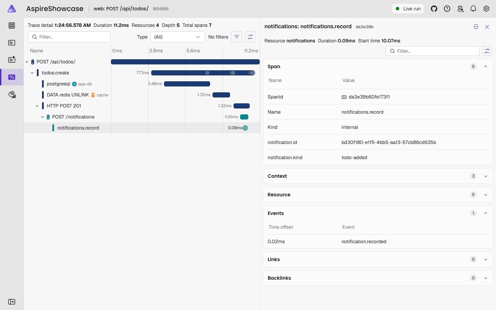

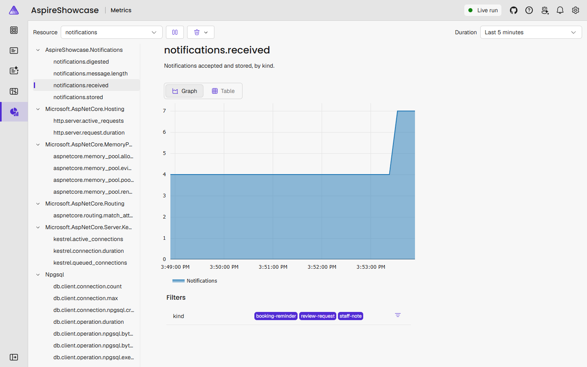

## Try failures

Three failures can be produced on a local run, to see how each looks in the dashboard. They affect the to-do endpoints only, so sign in to the app first.

Two of them are commands on the `web` resource (⋯ → Commands); **Stop simulated failures** turns both off. The third is stopping the `cache` resource.

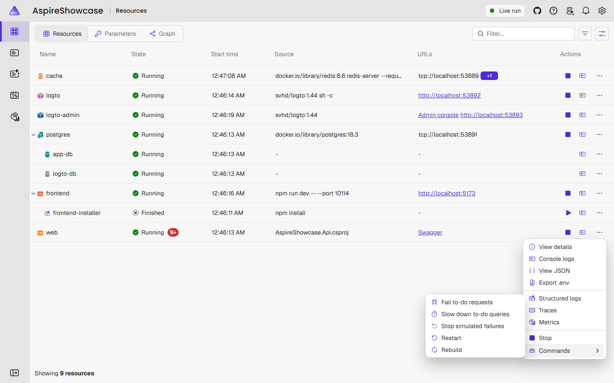

The commands post to `/api/failures/*`, which the API maps in Development only, and the AppHost adds the commands in run mode only, so none of this exists in Azure.

### Requests fail

**Fail to-do requests** makes every to-do request throw and answer 500. The to-do card in the app shows the error:

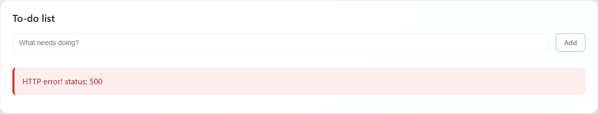

In Traces the request is red: status Error, 500, and the exception as an event on its bar.

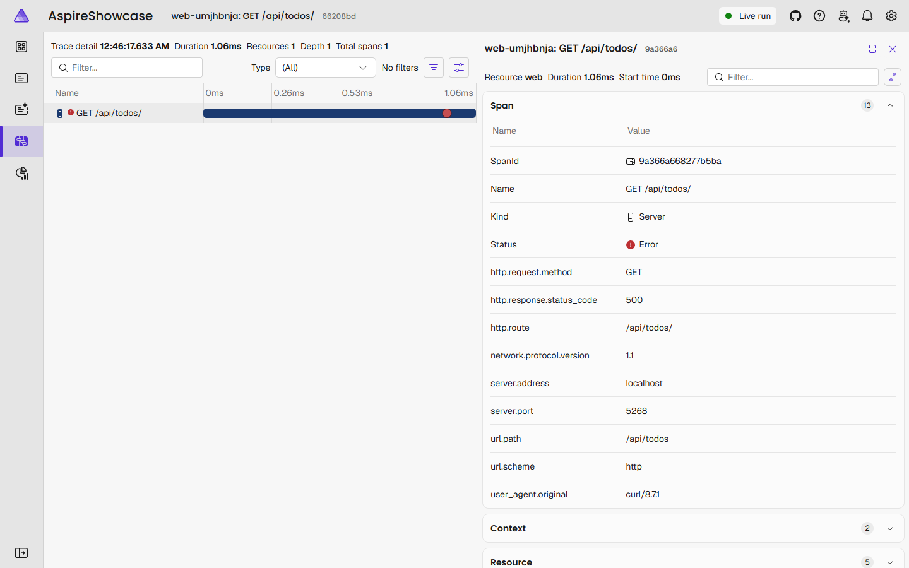

Structured logs filtered to Error list the exceptions, each linked to its trace:

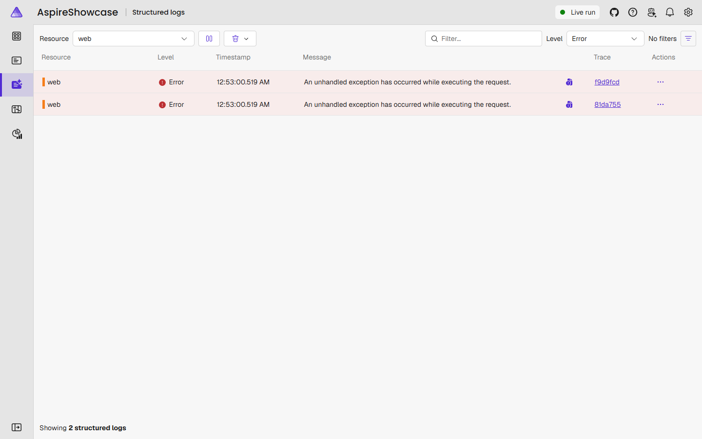

### Slow database

**Slow down to-do queries** makes every to-do request first run a 2-second query. The trace shows where the time went: the `app-db` span with `SELECT pg_sleep(2)` fills the request, and the app's own work takes milliseconds.

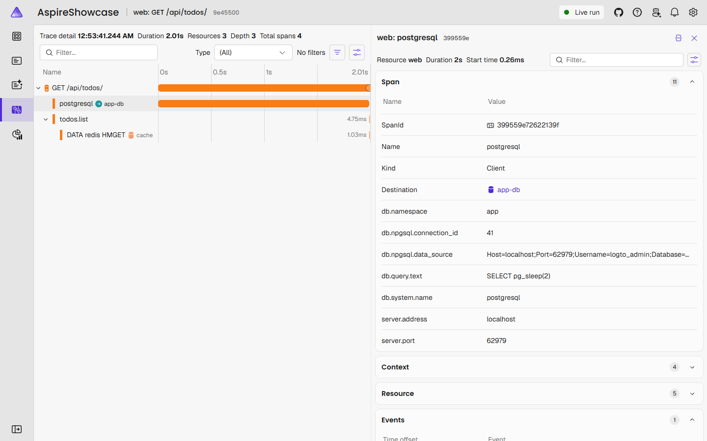

### Redis is down

Stop the `cache` resource. `web` turns Unhealthy, because its health check includes Redis:

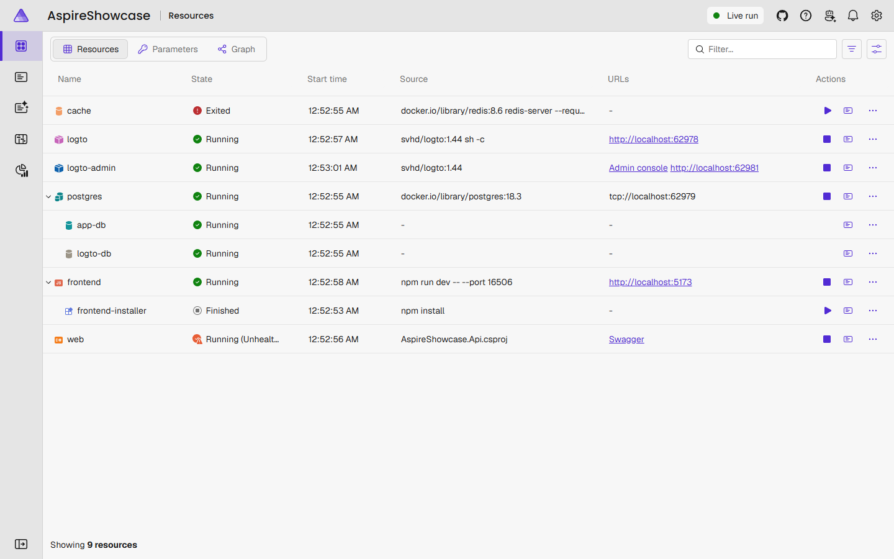

The to-do list keeps working from the database. The first request waits about 5 seconds for Redis, which the trace shows as a long `cache` span; later requests skip Redis for 15 seconds at a time. The span's events say what happened: `cache.unavailable` for the failed read, `cache.unavailable` (skipped) for the write, then `cache.miss`. The log has a warning.

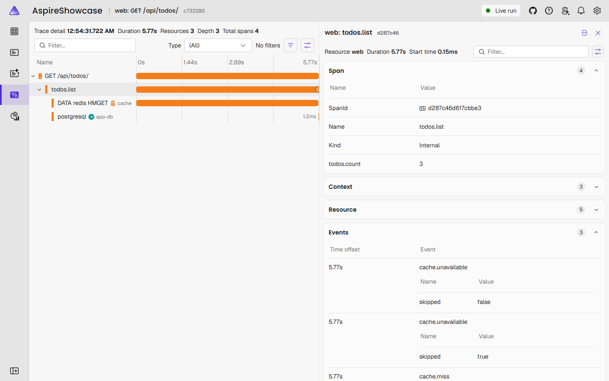

Start `cache` again and `web` returns to healthy.

### Notifications service is down

Stop the `notifications` resource. The first add or remove waits 3 seconds for it and then succeeds without a notification; the following ones don't wait. The Notifications card shows an error (503) until the service is started again. The `todos.create` and `todos.delete` spans carry a `notification.failed` event and the log has a warning.

## Deploy

One-time setup (after `az login`, `gh auth login`):

```powershell
./scripts/setup-azure-oidc.ps1 -GitHubRepo radekwojpl2/aspire-showcase

# other region / resource group
./scripts/setup-azure-oidc.ps1 -GitHubRepo radekwojpl2/aspire-showcase -Location northeurope -ResourceGroup rg-aspire-demo
```

Then push to `main`: CI runs, and if it passes, Deploy runs. After the first deploy, [set up sign-in](#set-up-sign-in).

| Workflow | Runs on |
|---|---|
| CI | PRs, pushes to `main` |
| Deploy | CI passing on `main`, manual |
| Deprovision | manual |

Each deploy prints the URL of the Aspire dashboard in Azure, `https://aspire-dashboard.ext.<environment>.westeurope.azurecontainerapps.io`.

Tear down:

```
gh workflow run deprovision.yml -f confirm=rg-aspire-showcase
```

This keeps the resource group and its role assignments, so Deploy works again without extra steps.

> [!IMPORTANT]
> If you run `aspire destroy` instead, it deletes the resource group too, so run `./scripts/setup-azure-oidc.ps1` again before the next deploy.

## Application Insights workbooks

Deploy publishes two workbooks to `insights` → Workbooks, each with a time range picker and tabs.

**Aspire showcase overview**: everything the app sends, server and browser.

| Tab | Shows |
|---|---|
| Requests | Request rate and failures, latency, endpoints, failed requests, outgoing calls (server and browser) |
| Metrics | A picker for any OpenTelemetry metric, HTTP server/client, GC heap, thread pool, all metrics |
| Browser | Page views, page load time, pages, browser exceptions |
| Logs & exceptions | Logs by severity, exceptions, warnings and errors, exceptions by type, recent logs |

**Aspire showcase API**: for finding out what is wrong with the API, its database or its cache. A summary row on top (requests, 4xx, 5xx, p95, exceptions, failed database and cache calls), then:

| Tab | Shows |
|---|---|
| Overview | Requests by status, latency, endpoints worst first, where the time goes per endpoint (database and cache calls and time per request), slowest requests |
| Failures | 5xx by endpoint, exceptions by type, failed requests with their exception, warning and error logs |
| Database | PostgreSQL queries and failures, query duration, statements by total time, failed queries, connection pool metrics |
| Cache | To-do list cache hits and misses, Redis commands, command duration, failed commands |
| To-dos | The API's custom telemetry: the `todos.*` metrics, the operation spans and their events |
| Notifications | Notifications sent by the API and received by the service, calls between the two, the service's spans and events |
| Runtime | Requests in progress, memory, thread pool, running instances, app starts and stops |
| Trace lookup | One trace in one view, from a pasted trace ID or span ID: the spans as a tree, with the pasted span and what is above and below it marked; logs, span events and exceptions in order; and the metrics reported around that time |