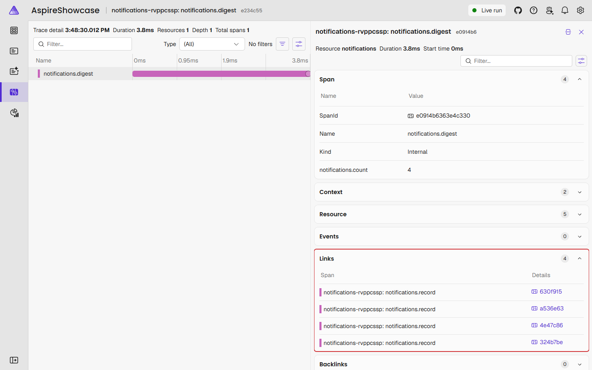
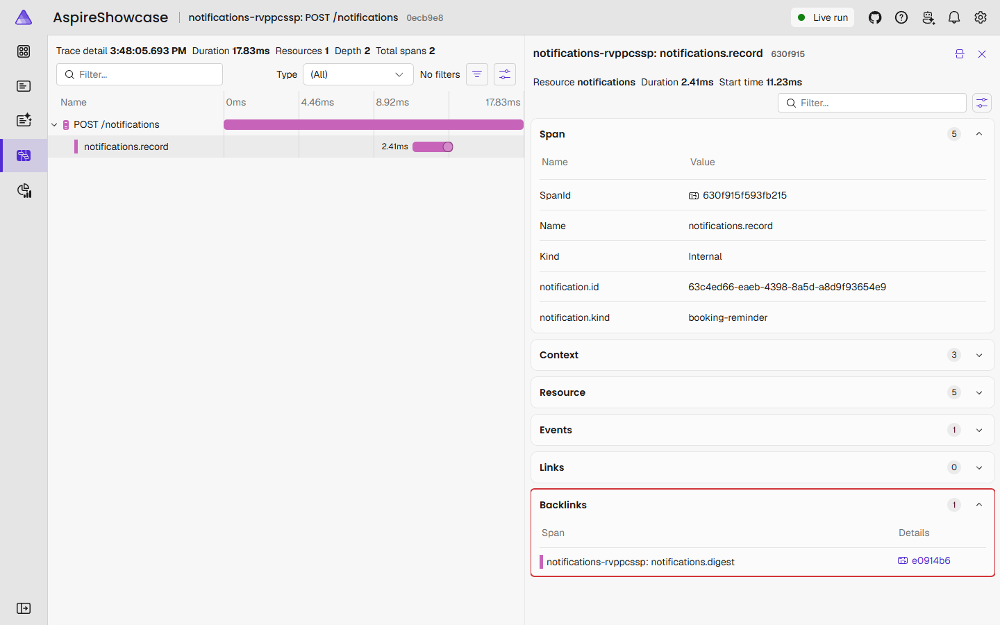

# Aspire Showcase

React + ASP.NET Core with [Aspire](https://aspire.dev), deployed to Azure Container Apps.

> [!NOTE]
> This project is just a showcase of what can be done with Aspire. It's not a production-ready app.

## What this shows

One AppHost describes the whole system: a React app, a backend for frontend (`bff`) that the browser talks to, an ASP.NET Core API behind it, a notifications service, RabbitMQ as the message bus between the API and that service, [Logto](https://logto.io) for sign-in, and one PostgreSQL server holding the app's, `bff`'s, the notifications service's and Logto's databases. The same description is used twice:

- **Locally**, `aspire run` starts everything on your machine (`bff`, the API and the notifications service as processes, Vite with hot reload, Logto, PostgreSQL and RabbitMQ as containers) and sends logs, traces and metrics to the Aspire dashboard.
- **In Azure**, `aspire deploy` turns it into Container Apps, a PostgreSQL Flexible Server, Key Vault and Application Insights, from a GitHub Actions workflow.

The app is a small appointment booking service: a business owner sets up their business, opening hours, services and staff, and clients book a free time on the business's public page. The point is the AppHost in `src/AspireShowcase.AppHost`, not the app.

## Local and Azure are not the same

The AppHost is the same code in both, but Aspire uses it differently. With `aspire run` it is a running program that starts the resources and hosts the dashboard. With `aspire deploy` it runs once to describe the system, which Aspire turns into Bicep and container images; nothing of the AppHost runs in Azure.

| | Local | Azure |
|---|---|---|
| bff, API, notifications service | Processes | Container Apps; only `bff` is public |
| React app | Vite dev server with hot reload, proxying to `bff` | Built into the `bff` container |
| PostgreSQL | Container with a data volume | Flexible Server |
| RabbitMQ | Container, with the management UI | Container App, one replica, no storage: a restart loses the messages still in its queues, `_error` queues included |
| Connection strings | Environment variables | Key Vault, read with managed identities |
| Logto | Containers | Container Apps |
| Parameters and secrets | AppHost user secrets | GitHub `production` environment |
| Telemetry | Aspire dashboard (in memory) | Application Insights, which keeps it, and an Aspire dashboard (in memory) |
| Swagger | Available | Not there |

So something that works locally can still fail in Azure.

## Run locally

Needs .NET 10, Node.js 22, Docker (for PostgreSQL, RabbitMQ and Logto) and the Aspire CLI (`dotnet tool install --global Aspire.Cli`).

```
aspire run
```

Open the `Dashboard:` link (e.g. `https://localhost:17019/login?t=...`), then `frontend`.

Starting a business needs sign-in: the first time, [set up Logto](#set-up-sign-in).

### Set up with an AI assistant

In [Claude Code](https://claude.com/claude-code), run `/setup`: it checks the prerequisites, starts the app and walks you through the Logto setup.

For Aspire itself (running, monitoring, deploying), the repo includes [Aspire's own skills](https://aspire.dev/get-started/aspire-skills/) and its MCP server configuration, generated by `aspire agent init`.

## Aspire dashboard

Resources, with their state, endpoints and the custom `Admin console` and `Swagger` links:


The same resources as a graph of references and wait dependencies:


Starting a business shows as one trace across services: the browser's `POST /api/businesses` reaches `bff`, which forwards it to `web` with the user's access token. Inside, `web`'s own `businesses.create` span holds the `app-db` queries and the calls to Logto's Management API that give the user the owner role.

## Layout

```
src/
├── AspireShowcase.AppHost/          # orchestration + Azure target
├── AspireShowcase.ServiceDefaults/  # telemetry, health checks
├── AspireShowcase.Bff/              # backend for frontend: sign-in, sessions, proxy; serves the UI in Azure
├── AspireShowcase.Api/              # API host (resource "web"), reachable only from bff
├── Modules/
│   ├── AspireShowcase.BusinessSetup/  # business, booking link, hours, services, staff
│   ├── AspireShowcase.BusinessSetup.PublicClient/  # how other modules talk to Business Setup
│   ├── AspireShowcase.Scheduling/     # bookings and the owner's calendar
│   ├── AspireShowcase.Scheduling.PublicClient/  # the messages Scheduling publishes
│   ├── AspireShowcase.Identity/       # anti-corruption layer over Logto
│   └── AspireShowcase.SharedKernel/   # what every module's domain may use
├── AspireShowcase.Notifications/    # notifications service: booking emails
└── AspireShowcase.Web/              # React + Vite
tests/
├── AspireShowcase.Api.IntegrationTests/ # the API against PostgreSQL in a container
├── AspireShowcase.Bff.IntegrationTests/ # bff, with web replaced by a stub
├── AspireShowcase.BusinessSetup.Tests/  # Business Setup's domain rules
└── AspireShowcase.Scheduling.Tests/     # Scheduling's domain rules
```

## Backend for frontend

The React app never holds a token. `bff` signs users in with Logto's authorization code flow as a confidential client (it has an app secret), keeps their ID, access and refresh tokens in its own database, and gives the browser only an HttpOnly session cookie. It forwards `/api/*` to `web` with [YARP](https://dotnet.github.io/yarp/), swapping the cookie for the user's access token and refreshing that token when it's about to expire.

| Path | Does |
|---|---|
| `/bff/login?returnUrl=/start` | Signs in through Logto; `&signup=true` opens Logto's sign-up form |
| `/bff/logout` | Signs out of `bff` and Logto (a form post) |
| `/bff/user` | Whether sign-in is set up, and who is signed in |
| `/api/*` | Forwarded to `web` |
| `/signin-oidc`, `/signout-callback-oidc` | Where Logto sends the browser back |

Against CSRF, the session cookie is `SameSite=Strict`, and `bff` refuses `/api` requests without an `X-CSRF: 1` header, which only the app's own scripts can send.

When a session can't be used any more (Logto rejected its refresh token, or it's gone from `bff-db`), `bff` deletes it and the cookie and answers `/api` with 401 and `X-Session-Ended: 1`, counting it in `sessions.ended`. The React app then signs in again and comes back to the same page. A 401 from `web` itself doesn't do this, so a misconfigured API can't send users round Logto in a loop. If Logto is down, the request fails but the session stays.

Everything `bff` serves has a Content-Security-Policy: scripts, styles and requests only from the app itself, plus Application Insights in Azure, no framing by other sites, and forms only to `bff` and Logto. With the tokens out of the browser, injected script is what's left to defend against. Locally the pages come from Vite, which needs inline scripts for hot reload, so the policy only applies in Azure.

Locally, Vite proxies these paths to `bff` and keeps the `Host` header, so Logto's redirect URIs are on `http://localhost:5173`. In Azure, `bff` serves the built React app itself, and `web` has no public endpoint.

## Database

One PostgreSQL server (`postgres`) with four databases: `app-db` for the API's modules, `bff-db` for `bff`'s sessions and data protection keys, `notifications-db` for the notifications service's MassTransit inbox and outbox, and `logto-db` for Logto. In `app-db`, each module has its own schema (`business_setup`, `scheduling`), `DbContext` and migrations, and only maps its own tables. Scheduling keeps its migration history in its schema; Business Setup's stays in `public.__EFMigrationsHistory`, where it was before the modules had schemas. Scheduling's no-overlap constraint needs the `btree_gist` extension, which the AppHost allows on the Flexible Server in Azure.

- Local: a container, with its data in a Docker volume.
- Azure: a Flexible Server. The connection strings are in Key Vault, and the Container Apps read them with their managed identities.

The API's modules, `bff` and the notifications service apply their EF Core migrations on startup. To add one after changing a model (a module's migrations are built through the API host):

```
dotnet tool restore
dotnet ef migrations add <Name> --project src/Modules/AspireShowcase.BusinessSetup --startup-project src/AspireShowcase.Api --context BusinessSetupDbContext
dotnet ef migrations add <Name> --project src/Modules/AspireShowcase.Scheduling --startup-project src/AspireShowcase.Api --context SchedulingDbContext
dotnet ef migrations add <Name> --project src/AspireShowcase.Bff
dotnet ef migrations add <Name> --project src/AspireShowcase.Notifications
```

## Notifications

A second ASP.NET Core service (`notifications`) that sends the booking emails (user stories MVP-5, MVP-7, MVP-13 and MVP-14) through [Resend](https://resend.com). It hears about bookings over a message bus, [MassTransit](https://masstransit.io) on RabbitMQ (`messaging`), never by being called:

1. Booking or cancelling publishes `BookingConfirmed` or `BookingCancelled` through MassTransit's transactional outbox in Scheduling's schema: the message is saved in the same transaction as the booking and sent afterwards, so neither exists without the other.
2. A consumer in `web` looks up what the emails need (names, local times, the owner's email from Logto) and publishes a `BookingNotice`. Keeping that out of the request means booking doesn't fail when Logto is slow.
3. `notifications` consumes it through MassTransit's inbox in `notifications-db`, so a redelivered message sends nothing twice, and sends the emails with an idempotency key that Resend checks too. A failed message is retried with growing waits, then lands in an `_error` queue in RabbitMQ.

The message contracts are in `AspireShowcase.Scheduling.PublicClient`. Locally the `messaging` resource links to RabbitMQ's management UI, to watch the queues. Emails need two settings:

```
dotnet user-secrets set Parameters:resend-api-key <api-key> --project src/AspireShowcase.AppHost
dotnet user-secrets set Parameters:email-sender "Bookings <bookings@yourdomain.com>" --project src/AspireShowcase.AppHost
```

In Azure, set them on the `production` environment: the `RESEND_API_KEY` secret and the `EMAIL_SENDER` variable.

Until both are set, booking works as usual, and each email is skipped: logged as a warning and counted in `notifications.emails` with `result=skipped`. A skipped email isn't kept for later, so bookings made before the settings were set never get theirs.

The sender's domain must be verified in Resend. Resend's test sender, `onboarding@resend.dev`, only delivers to the address of your Resend account; for anyone else Resend refuses the email, and the message is retried and ends up in the `_error` queue. The service also keeps the latest 50 notifications in memory.

- Local: a process.
- Azure: a Container App with no external endpoint.

A [Quartz.NET](https://www.quartz-scheduler.net) job, `NotificationDigestJob`, runs every 30 seconds and logs a summary of the notifications recorded since its last run. It is there to show how work that runs outside a request looks in telemetry: a scheduled job has no request to belong to, so its span starts a trace of its own.

To tie that trace back to what caused it, the job's span carries a span link to each `notifications.record` span it summed up. See [Span links](#span-links).

## Logto

[Logto](https://logto.io) handles authentication. It runs as two containers from the same image, sharing one database:

| Resource | Port | Serves |
|---|---|---|
| `logto` | 3001 | Sign-in and OIDC endpoints (`ENDPOINT`). Seeds the database on first start. |
| `logto-admin` | 3002 | Admin console at `/console` (`ADMIN_ENDPOINT`) |

Two containers, because a Container App has only one HTTP ingress port.

Its database is `logto-db` (see [Database](#database)). Logto wants a `postgresql://` URL rather than a .NET connection string, so in Azure the URL is stored in Key Vault as its own secret, `logto-db-url`.

Locally both run on those ports, so Logto's address, the issuer of every token, stays the same between runs. The console is served on `http://127.0.0.1:3002/console`, not `localhost`: Logto runs in production mode, which blocks the console's API calls from a `localhost` address. The dashboard links to it.

### Set up sign-in

Local and Azure each have their own Logto with its own database, so do this once in each. In Azure, do it after the first deploy and again after a Deprovision, which empties the Logto database and changes the URLs.

| | Local | Azure |
|---|---|---|
| Admin console | `Admin console` link on the `logto-admin` resource | `https://<logto-admin-fqdn>/console` |
| App URL | `http://localhost:5173` | `https://<bff-fqdn>` |

The Azure host names:

```
az containerapp list -g rg-aspire-showcase --query "[].{name:name, fqdn:properties.configuration.ingress.fqdn}" -o table
```

1. Open the admin console and create the admin account. Whoever opens it first becomes the admin.
2. **API resources** → **Create API resource**: any name, identifier `https://api.aspire-showcase`. It must match `ApiResource` in `Logto/LogtoExtensions.cs`. On its **Permissions** tab, add `manage:business`.
3. **Roles** → **Create role**: name `owner`, type **User**, with the `manage:business` permission of that API resource. The API gives it to everyone who starts a business.
4. **Applications** → **Create application** → **Traditional web**, for `bff`. On it, add:
   - **Redirect URIs**: `<app-url>/signin-oidc`
   - **Post sign-out redirect URIs**: `<app-url>/signout-callback-oidc`

   Note its **App ID** and **App secret**.
5. **Applications** → **Create application** → **Machine-to-machine**, for the API to call Logto's Management API. Give it a role with the Logto Management API's `all` permission. Note its **App ID** and **App secret**.
6. **Sign-in experience**: allow sign-up (e.g. with a username and password), so people can create their account when they start a business.
7. Give the four values to the AppHost.

   Local, then restart the AppHost:

   ```
   dotnet user-secrets set Parameters:logto-app-id <app-id> --project src/AspireShowcase.AppHost
   dotnet user-secrets set Parameters:logto-app-secret <app-secret> --project src/AspireShowcase.AppHost
   dotnet user-secrets set Parameters:logto-m2m-app-id <m2m-app-id> --project src/AspireShowcase.AppHost
   dotnet user-secrets set Parameters:logto-m2m-app-secret <m2m-app-secret> --project src/AspireShowcase.AppHost
   ```

   Azure, then deploy again:

   ```
   gh variable set LOGTO_APP_ID --env production --body "<app-id>"
   gh secret set LOGTO_APP_SECRET --env production --body "<app-secret>"
   gh variable set LOGTO_M2M_APP_ID --env production --body "<m2m-app-id>"
   gh secret set LOGTO_M2M_APP_SECRET --env production --body "<m2m-app-secret>"
   gh workflow run Deploy
   ```

Then open the app and click **Start your business**: it takes you to Logto's sign-up, then to the form. Once the business is created you're signed in again, so the new owner role is in the access token, and the header shows **Owner**. `<app-url>/bff/user` shows whether sign-in is on, in `signInEnabled`.

## Custom telemetry

On top of what ASP.NET Core, the HTTP clients and Npgsql record by themselves, the API's modules and the notifications service record their own spans, span events and metrics, and `bff` a metric of its own. The notifications service and `bff` name theirs after the application, which is what the ServiceDefaults project subscribes to; an API module uses its own name and subscribes to it when the host adds the module. Names, links and messages that users type are never recorded.

The API's Business Setup module, `AspireShowcase.BusinessSetup`, in `src/Modules/AspireShowcase.BusinessSetup/BusinessTelemetry.cs`:

| Metric | Kind | Measures |
|---|---|---|
| `businesses.created` | Counter | Businesses started |
| `businesses.rejected` | Counter | Attempts turned down (`reason` tag: `invalid`, `slug_taken`, `already_owner`, `logto_unavailable`) |
| `businesses.opening_hours.changes` | Counter | Opening hours saved (`result` tag: `saved`, `invalid`) |
| `businesses.services.changes` | Counter | Services added, changed, hidden and shown (`result` tag: `added`, `changed`, `hidden`, `shown`, `invalid`, `name_taken`) |
| `businesses.staff.changes` | Counter | Staff members added and changed (`result` tag: `added`, `changed`, `invalid`, `name_taken`) |

Its `businesses.create` span carries a `business.created` or `business.rejected` event, `businesses.opening_hours.set` an `opening_hours.saved` or `opening_hours.invalid` one, the `businesses.services.*` spans a `service.<result>` one, and the `businesses.staff.*` spans a `staff_member.<result>` one.

The Scheduling module, `AspireShowcase.Scheduling`, in `src/Modules/AspireShowcase.Scheduling/SchedulingTelemetry.cs`:

| Metric | Kind | Measures |
|---|---|---|
| `bookings.attempts` | Counter | Attempts to book (`result` tag: `booked`, `slot_taken`; `source` tag: `client`, `sample`) |
| `bookings.cancellations` | Counter | Bookings cancelled (`by` tag: `client`, `business`) |

Its `bookings.book` span is a client booking, `bookings.cancel` a cancellation, `availability.slots` says how many free slots were found, `bookings.calendar` which view was read and how many bookings it had, and `bookings.sample` how many sample bookings were made and refused. Client names and emails are never recorded.

The notifications service, in `src/AspireShowcase.Notifications/NotificationTelemetry.cs`:

| Metric | Kind | Measures |
|---|---|---|
| `notifications.received` | Counter | Notifications accepted and stored (`kind` tag) |
| `notifications.rejected` | Counter | Notifications refused as invalid |
| `notifications.message.length` | Histogram | Characters in the messages received |
| `notifications.stored` | Gauge | Notifications currently kept in memory |
| `notifications.digested` | Counter | Notifications summed up by the scheduled digest |
| `notifications.emails` | Counter | Booking emails (`kind` tag; `result` tag: `sent`, `skipped`) |

`bff`, in `src/AspireShowcase.Bff/Sessions/SessionTelemetry.cs`:

| Metric | Kind | Measures |
|---|---|---|
| `sessions.ended` | Counter | Sessions ended because `bff` couldn't get an access token for them (`reason` tag: `refresh_failed`, `session_not_found`) |

MassTransit records its own spans and metrics too, so a booking's trace runs from the request through the outbox and RabbitMQ to the email being sent.


### Span links

The digest job runs on a schedule, not inside a request, so its `notifications.digest` span starts a trace of its own. It carries a span link to every `notifications.record` span whose notification it summed up. In the span details, the digest lists them under **Links**, and each `notifications.record` span shows the digest under **Backlinks**. A run with nothing new records no span.

To see it locally, post a few notifications to the service (its address is on the `notifications` resource), wait up to 30 seconds, and open the `notifications.digest` trace of the `notifications` resource:

```
curl -X POST http://localhost:5186/notifications -H "Content-Type: application/json" -d "{\"kind\":\"test\",\"message\":\"Hello\"}"
```

The digest's span, with one link per notification it summed up (outlined in red). Each link opens the trace that recorded the notification:



From the other side, a `notifications.record` span shows the digest that picked it up under Backlinks:



The job also logs one line per run, such as `Digest of 3 notifications: 3 test`, inside the digest's span, and counts what it summed up in `notifications.digested`.

## Deploy

One-time setup (after `az login`, `gh auth login`):

```powershell
./scripts/setup-azure-oidc.ps1 -GitHubRepo radekwojpl2/aspire-showcase

# other region / resource group
./scripts/setup-azure-oidc.ps1 -GitHubRepo radekwojpl2/aspire-showcase -Location northeurope -ResourceGroup rg-aspire-demo
```

The script lets the Deploy workflow sign in to Azure with OIDC, so no Azure secret is stored in GitHub. It creates an app registration in Entra ID that trusts tokens GitHub issues for this repository's `production` environment, and gives it two roles on the resource group:

- **Contributor**, to create the resources.
- **User Access Administrator**, because the deployment assigns roles to the apps' managed identities.

A managed identity is an identity in Entra ID that Azure creates for a resource and keeps the credentials of. The app asks Azure for a token at run time, so there is no password or key to store or rotate. The deployment creates one for each Container App, which uses it to pull its image from the container registry (AcrPull) and to read its connection strings from Key Vault (Key Vault Secrets User).

Then start the Deploy workflow by hand: **Actions** → **Deploy** → **Run workflow** on GitHub, or `gh workflow run Deploy`. It deploys `main`; merging to `main` does not deploy by itself. After the first deploy, [set up sign-in](#set-up-sign-in).

| Workflow | Runs on |
|---|---|
| CI | PRs, pushes to `main` |
| Deploy | manual, `main` only |
| Deprovision | manual |

Each deploy prints the URL of the Aspire dashboard in Azure, `https://aspire-dashboard.ext.<environment>.westeurope.azurecontainerapps.io`.

Tear down:

```
gh workflow run deprovision.yml -f confirm=rg-aspire-showcase
```

This keeps the resource group and its role assignments, so Deploy works again without extra steps.

> [!IMPORTANT]
> If you run `aspire destroy` instead, it deletes the resource group too, so run `./scripts/setup-azure-oidc.ps1` again before the next deploy.

## Application Insights workbooks

Deploy publishes two workbooks to `insights` → Workbooks.

**Aspire showcase overview**: everything the app sends, server and browser.

| Tab | Shows |
|---|---|
| Requests | Rate, failures, latency, outgoing calls |
| Metrics | Any OpenTelemetry metric, HTTP, runtime |
| Browser | Page views, load time, exceptions |
| Sign-in | Sessions `bff` ended and why, refresh tokens Logto rejected, sign-ins, calls to Logto |
| Logs & exceptions | Logs by severity, exceptions by type |

**Aspire showcase API**: for finding what is wrong with the API or its database.

| Tab | Shows |
|---|---|
| Overview | Requests, latency, slowest endpoints |
| Failures | 5xx, exceptions, error logs |
| Database | PostgreSQL queries, duration, failures |
| Bookings | Bookings made and refused, cancellations, businesses started and turned down, setup changes |
| Notifications | Booking emails sent and skipped, messages on the bus and failed ones, received notifications, the digest job and its span links |
| Runtime | Memory, thread pool, instances, restarts |
| Trace lookup | Everything for one pasted trace ID or span ID |
