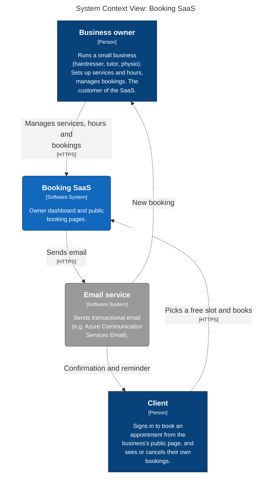
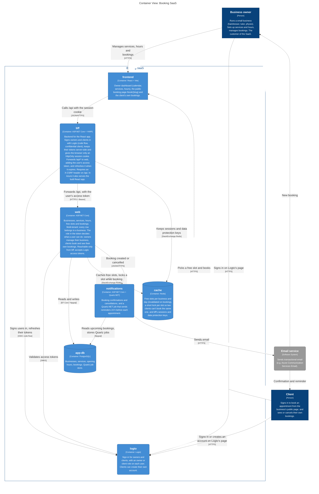
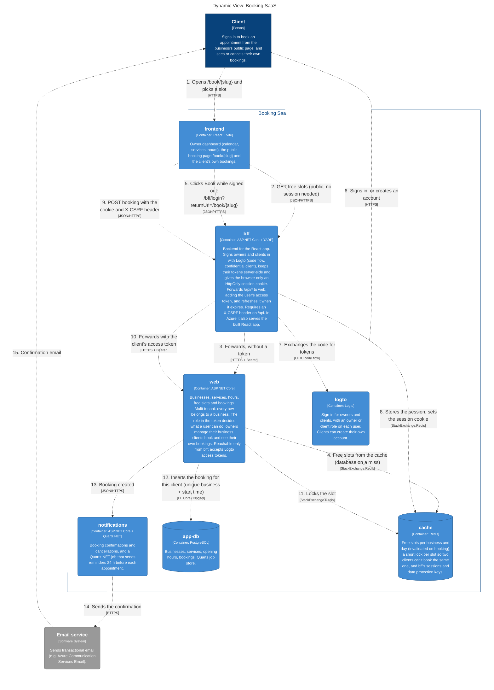
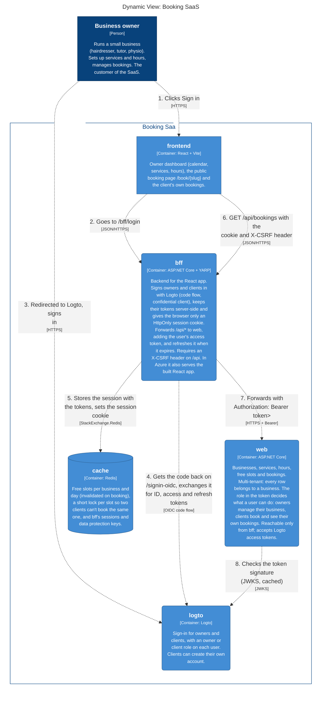
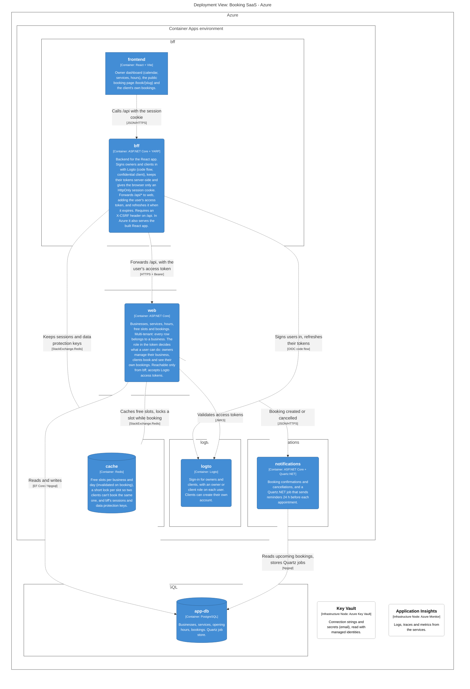

# Booking SaaS: architecture (arc42)

Architecture of the proposed booking SaaS, following the [arc42](https://arc42.org) template. The diagrams come from the Structurizr model in [`workspace.dsl`](workspace.dsl): change the model, then run `scripts/export-diagrams.ps1` to update them here.

1. [Introduction and Goals](#1-introduction-and-goals)
2. [Architecture Constraints](#2-architecture-constraints)
3. [Context and Scope](#3-context-and-scope)
4. [Solution Strategy](#4-solution-strategy)
5. [Building Block View](#5-building-block-view)
6. [Runtime View](#6-runtime-view)
7. [Deployment View](#7-deployment-view)
8. [Cross-cutting Concepts](#8-cross-cutting-concepts)
9. [Architecture Decisions](#9-architecture-decisions)
10. [Quality Requirements](#10-quality-requirements)
11. [Risks and Technical Debt](#11-risks-and-technical-debt)
12. [Glossary](#12-glossary)

## 1. Introduction and Goals

Not written yet.

## 2. Architecture Constraints

Not written yet.

## 3. Context and Scope

<!-- diagram: Context -->

<!-- /diagram -->

## 4. Solution Strategy

Not written yet.

## 5. Building Block View

### Level 1: Containers

<!-- diagram: Containers -->

<!-- /diagram -->

## 6. Runtime View

### A client books a slot

<!-- diagram: BookASlot -->

<!-- /diagram -->

### An owner signs in

<!-- diagram: OwnerSignIn -->

<!-- /diagram -->

## 7. Deployment View

### Azure

<!-- diagram: AzureDeployment -->

<!-- /diagram -->

## 8. Cross-cutting Concepts

Not written yet.

## 9. Architecture Decisions

Not written yet.

## 10. Quality Requirements

Not written yet.

## 11. Risks and Technical Debt

Not written yet.

## 12. Glossary

Not written yet.
